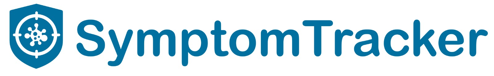
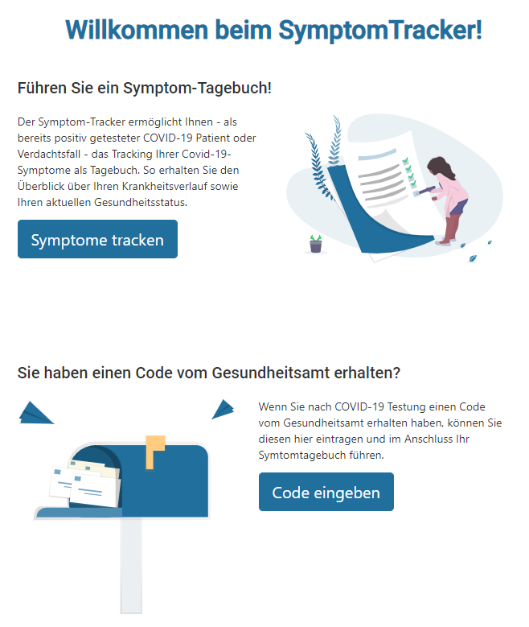

Platform to track symptomes of COVID-19 for patients and discharge of the health department.

This project was generated with [Angular CLI](https://github.com/angular/angular-cli) version 9.0.7.

## Development server

Run `ng serve` for a dev server. Navigate to `http://localhost:4200/`. The app will automatically reload if you change any of the source files.

## Built With

* [Angular](https://angular.io/) To get started with Angular and our project, look here: `https://angular.io/guide/setup-local`
* [Bootstrap](https://ng-bootstrap.github.io/#/home) To use bootstrap with angular: `https://ng-bootstrap.github.io/#/getting-started`

## Authors

The initial Project was created by participants of the [Symptomtracker Team](https://devpost.com/software/symptomtracker-62xhkp).

* **Jana** -- [janaesselborn](https://github.com/janaesselborn)
* **Domenik** - [koalamitice](https://github.com/koalamitice)
* **Maxi ** - [vonunwerth]((https://github.com/vonunwerth)
* **Alex** - [xan2063](https://github.com/xan2063)
* **Andrea** - [andreaaa87](https://github.com/andreaaa87)
* **Jannis** - [Jannis912](https://github.com/jannis912)

See also the list of [contributors](https://github.com/symptomtracker/backend/contributors) who participated in this project.

## License

This project is licensed under the MIT License - see the [LICENSE.md](LICENSE.md) file for details

## See also on

* [YouTube](https://www.youtube.com/channel/UCQtwhY5A4YLoXUxC61mvbaA)
* [Twitter](https://twitter.com/symptomtracker1)
* [DevPost](https://devpost.com/software/symptomtracker-62xhkp)
